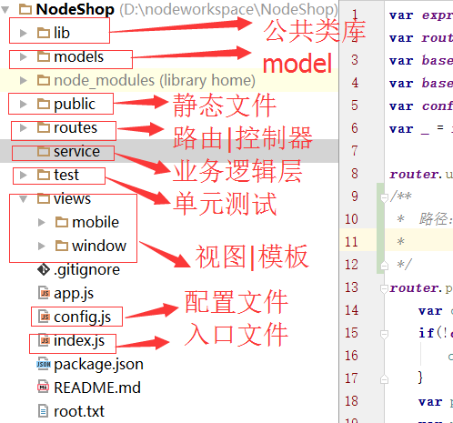

# NodeShop  
## 项目说明  
###  How to use  
1.运行项目，执行node index.js  
2.如有模块未安装，先执行npm install  
3.访问http://localhost:5050  
### html2jade使用方法  
1.安装执行 npm install -g html2jade  
2.转换某个HTML文件执行  
  html2jade index.html  
### 自动生成sequelizejs模型文件  
 npm install -g sequelize-auto  
 必须全局安装以下数据库工具：  
 Example for MySQL/MariaDB   
 npm install -g mysql   
 
 Example for Postgres   
 npm install -g pg pg-hstore 
 
 Example for Sqlite3   
 npm install -g sqlite  
 
 Example for MSSQL   
 npm install -g tedious  
 用法：  
 [node] sequelize-auto -h <host> -d <database> -u <user> -x [password] -p [port]  --dialect [dialect] -c [/path/to/config] -o [/path/to/models] -t [tableName] -C  
 Options:  
   -h, --host        IP/Hostname for the database.   [required]  
   -d, --database    Database name.                  [required]  
   -u, --user        Username for database.  
   -x, --pass        Password for database.  
   -p, --port        Port number for database.  
   -c, --config      JSON file for Sequelize's constructor "options" flag object as defined here: https://sequelize.readthedocs.org/en/latest/api/sequelize/  
   -o, --output      What directory to place the models.  
   -e, --dialect     The dialect/engine that you're using: postgres, mysql, sqlite  
   -a, --additional  Path to a json file containing model definitions (for all tables) which are to be defined within a model's configuration parameter. For more info: https://sequelize.readthedocs.org/en/latest/docs/models-definition/#configuration  
   -t, --tables      Comma-separated names of tables to import  
   -T, --skip-tables Comma-separated names of tables to skip  
   -C, --camel       Use camel case to name models and fields  
   -n, --no-write    Prevent writing the models to disk.  
   -s, --schema      Database schema from which to retrieve tables  
   示例：  
   sequelize-auto -o "./models" -d app_neetao -h 192.168.49.128 -u root -p   3306 -x 123456 -e mysql  
### 项目结构        

#### 测试
 